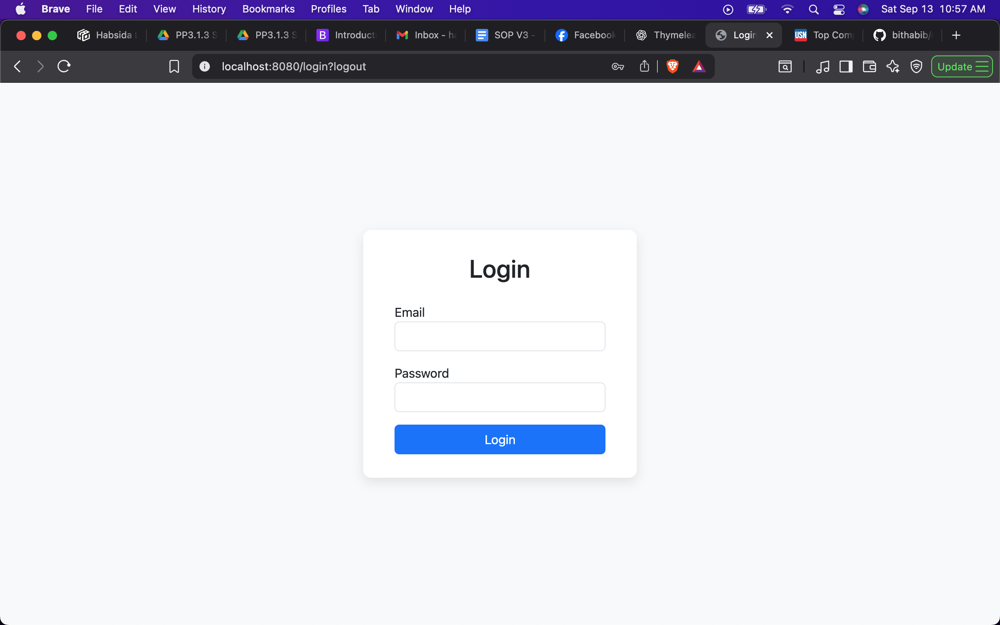
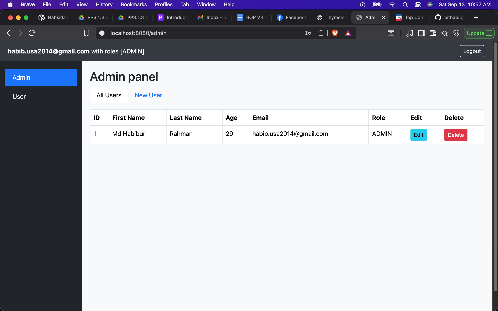
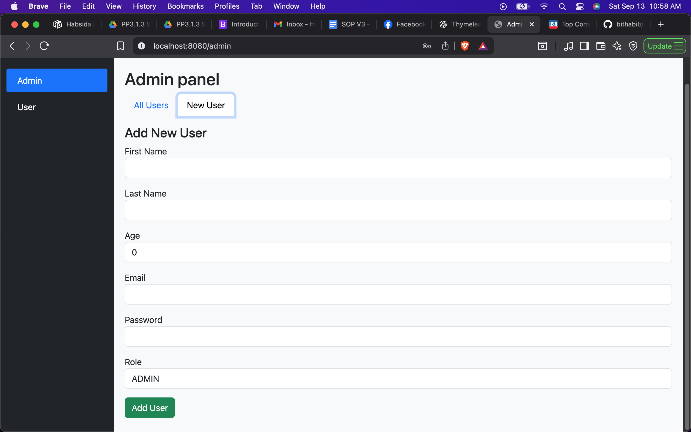
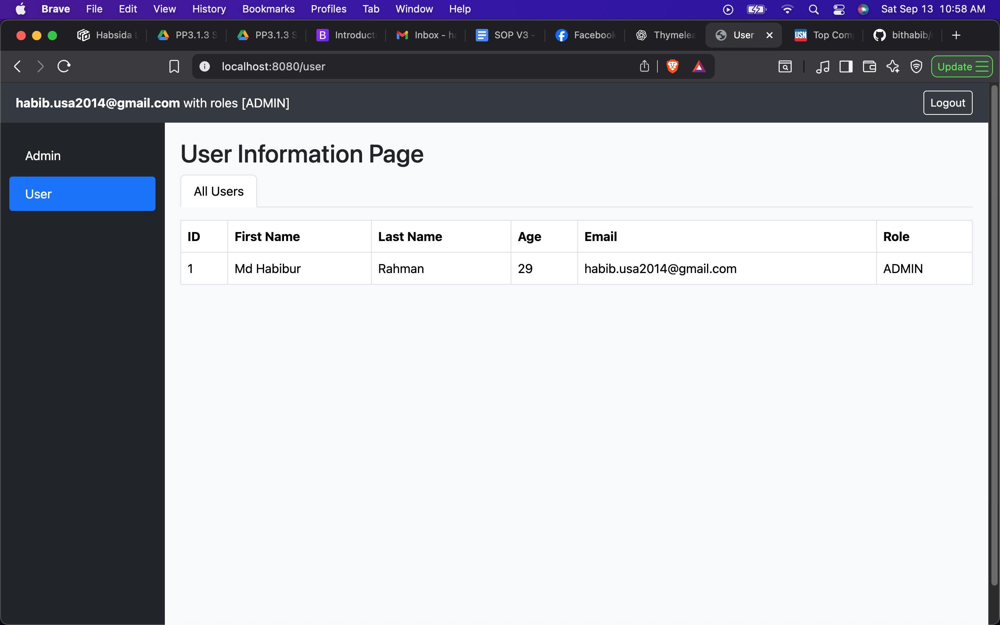
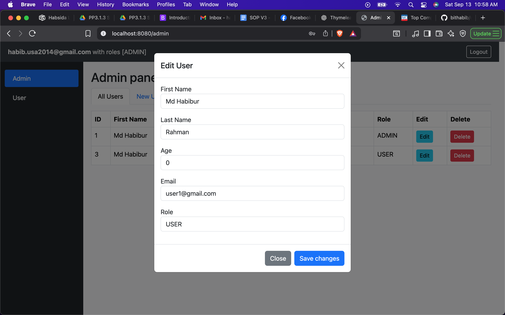
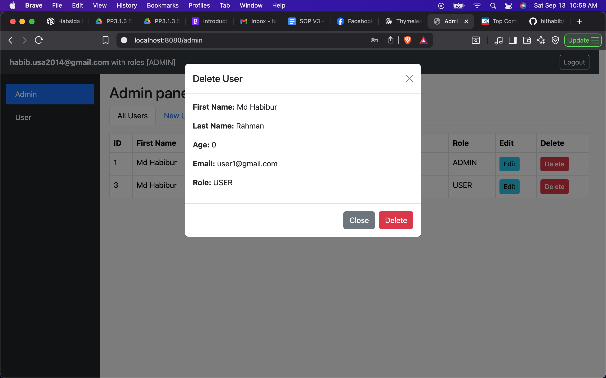

# User Management Web Application

This project is a Java Spring Boot web application with Thymeleaf templates that manages users with roles (`ADMIN` and `USER`).  
Below are screenshots of the key pages and functionalities.

---
## 1. Login Page
The Login page allows users to log in with their credentials. It includes fields for username and password
and a login button.

---

## 2. Admin Page
The Admin page allows the admin to view all users, add new users, edit existing users, and delete users.

---

## 2. Add User Page
The Add User page allows the admin to create a new user by filling out a form with username
and password fields.

---

## 3. User Page
The User page shows the details of the currently logged-in user. Users cannot see admin-only functionalities.

---

## 4. Update User Modal
The Update modal allows admins to edit the details of an existing user.

---

## 5. Delete User Modal
The Delete modal shows the user details in read-only format and allows admins to confirm deletion.

---

## Notes
- Screenshots are stored in `src/main/resources/static/screenshots/`.
- Make sure to replace the image paths with the actual file names of your screenshots.
- Use proper naming conventions for screenshots: `admin_page.png`, `user_page.png`, etc.
